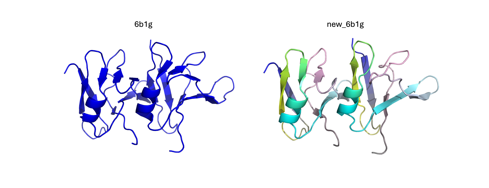
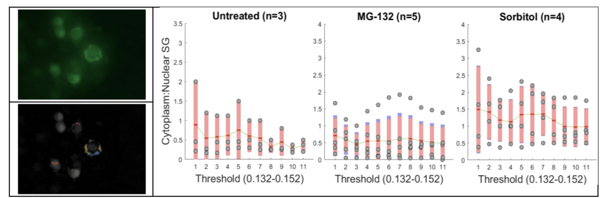
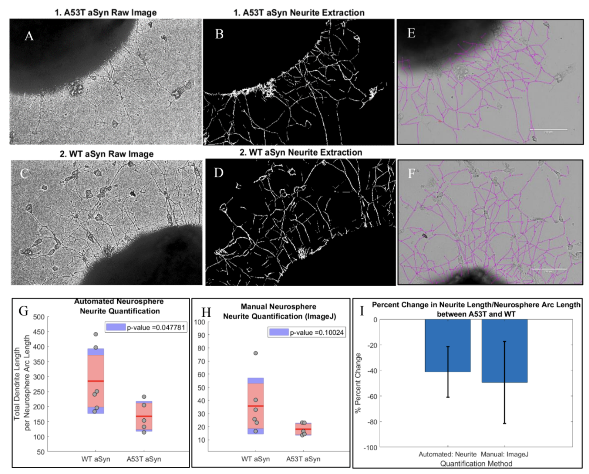

# MATLAB_CompBio
MATLAB Scripts for Various Computational Biology Tasks
## populateTemp
This function can swap out the tempFactor column in a PDB file with any numeric column vector inputted by the user. This function can be used to populate per residue continuous metrics from molecular dynamics such as RMSD, surface area, hydrogen bond lifetimes; or per residue discrete/categorical metrics such as sites of post-translational modification or disease-associated mutations.

populateTemp(pdb, col, name) 

INPUTS:

pdb: filename

col: numeric column vector (M x N, where N is number of residues in PDB structure and M is the number of chains)

name: new filename

Usage Example:

populateTemp('6b1g.pdb',[[1:80'],[1:80']],'new_6b1g.pdb')

Open files in PyMOL and color by tempFactor column: spectrum b, blue yellow cyan neon pink grey

## fit_int_autocorr
This function integrates the per residue hydrogen bond count autocorrelation function extracted from solvated molecular dynamics to calculate the average hydrogen bond lifetime at each residue of the simulated protein.

[f, g, l] = fit_int_autocorr(t,h)

INPUTS:

t: autocorrelation time window (need to know sampling rate to generate appropriate vector, use linspace()) 

h: per residue hydrogen bond count autocorrelation

OUTPUTS:
f: fitobject from curve fitting to biexponential curve (a*exp(-x/b1)+(1-a)*exp(-x/b2))

g: goodness of fit 

l: per resiude integrated average hydrogen bond lifetime

See "hbl_sample.m" for sample code on how to call function. The code should output the following figure (scatter is MD autocorrelation data for single residue, red line is fit generated by fit_int_autocorr)

See following references for applications:

Kochen, N. N., Seaney, D., Vasandani, V., Murray, M., Braun, A. R., & Sachs, J. N. (2024). Post-translational modification sites are present in hydrophilic cavities of alpha-synuclein, tau, FUS, and TDP-43 fibrils: A molecular dynamics study. Proteins, 92(7), 854–864. https://doi.org/10.1002/prot.26679

Nathan Kochen, N., Vasandani, V., Seaney, D., Pandey, A. K., Walters, M. A., Braun, A. R., & Sachs, J. N. (2022). Threonine Cavities Are Targetable Motifs That Control Alpha-Synuclein Fibril Growth. ACS chemical neuroscience, 13(17), 2646–2657. https://doi.org/10.1021/acschemneuro.2c00327

## convert_to_fasta
This function converts a list of DNA, RNA or protein sequences (entered in separate lines) to a FASTA file with numerical headers (1,2,3,...,N, where N is the number of sequences in the input text file). Useful for downstream analysis of sequences such as (motif search, multiple sequence alignment, etc). 

INPUTS:
input_file: text file with list of sequences entered in separate lines

OUTPUTS:
output.fasta: FASTA file with input sequences and numerical headers

Example: 

If the following sequences are inputted: 

UAGGUGGCAGGGCAGAAACUGGGCAGCCCUGACUUGAUAGC  
AUAGUGUGUGUGAGGAAACAGUAGAAG

The resulting output is: 

\>1 
UAGGUGGCAGGGCAGAAACUGGGCAGCCCUGACUUGAUAGC  
\>2 
AUAGUGUGUGUGAGGAAACAGUAGAAG

## stressGranules
This script quantifies cytoplasmic and nuclear puncta from fluorescence images (puncta channel + nuclear channel required). Example below is of human FUS, a protein involved in ALS, under proteasomal stress (MG-132) and hyperosmotic stress (sorbitol), which cause FUS to aggregate into puncta.

## neuriteLength
This script automatically quantifies average neurite length from neuronal organoids with similar performance as ImageJ neurite tracker function. 

