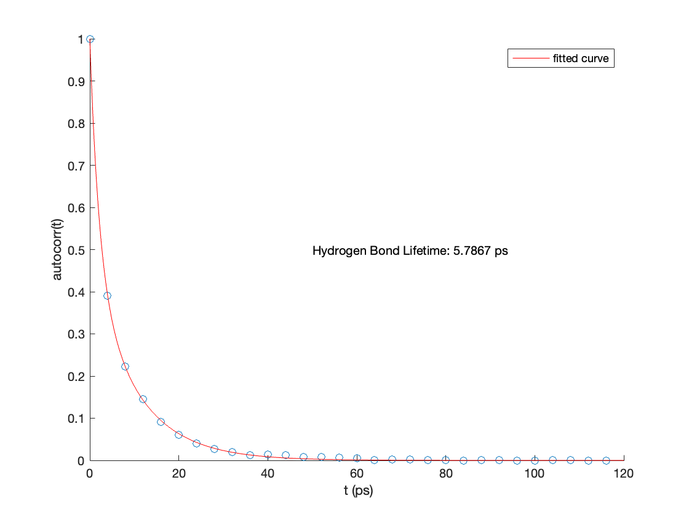

# MATLAB_CompBio
MATLAB Scripts for Various Computational Biology Tasks
## populateTemp
This function can swap out the tempFactor column in a PDB file with any numeric column vector inputted by the user. This function can be used to populate per residue continuous metrics from molecular dynamics such as RMSD, surface area, hydrogen bond lifetimes; or per residue discrete/categorical metrics such as sites of post-translational modification or disease-associated mutations.

populateTemp(pdb, col, name) 

INPUTS:
pdb: filename

col: numeric column vector (M x N, where N is number of residues in PDB structure and M is the number of chains)

name: new filename

Usage Example:

populateTemp('6b1g.pdb',[[1:80'],[1:80']],'new_6b1g.pdb')

Open files in PyMOL and color by tempFactor column: spectrum b, blue yellow cyan neon pink grey

## fit_int_autocorr
This function integrates the per residue hydrogen bond count autocorrelation function extracted from solvated molecular dynamics to calculate the average hydrogen bond lifetime at each residue of the simulated protein.

[f, g, l] = fit_int_autocorr(t,h)

INPUTS:
t: autocorrelation time window (need to know sampling rate to generate appropriate vector, use linspace()) 

h: per residue hydrogen bond count autocorrelation

OUTPUTS:
f: fitobject from curve fitting to biexponential curve (a*exp(-x/b1)+(1-a)*exp(-x/b2))

g: goodness of fit 

l: per resiude integrated average hydrogen bond lifetime

